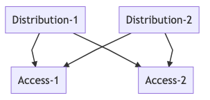

# Single Site ESI-Lag (collapsed-core)

This will define a set of IP-Clos/Distribution-Access switches. </br>

## Note: This is an early draft of the API for EVPN-VXLAN. Things could change prior to going GA.

</br></br>

### Required Variables:

-   `site_id` xxxxxxxx-xxxx-xxxx-xxxx-00000000000b
-   `device_id` (Distribution-1)
-   `device_id` (Distribution-2)
-   `device_id` (Access-1)
-   `device_id` (Access-2)
-   `mac_address` (Distribution-1)
-   `mac_address` (Distribution-2)
-   `mac_address` (Access-1)
-   `mac_address` (Access-2)

## EVPN Topology:

In this topology, the EVPN extends down to the access layer. All
switches participate in the EVPN.



<div style="page-break-after: always">

</div>

## Step 1: (Define Networks/VRFs)

This payload configures 2 networks (`vlan101`, `vlan102`) that go into
the `internal_vrf`. The internal VRF also include a static route.

We also specify the EVPN option, but these are not required.

This can also be applied to a network template, this example is using a
site only.

<div style="page-break-after: always">

</div>

    PUT:
    /api/v1/sites/:site_id/setting

``` json
{
    "evpn_options": {
    "overlay": {
        "as": 65000
    },
        "underlay": {
            "as_base": 65001,
            "subnet": "10.255.240.0/20"
        }
    },
    "networks": {
        "vlan101": {
            "vlan_id": "101",
            "subnet": "192.168.101.0/24",
            "gateway": "192.168.101.1"
        },
        "vlan102": {
            "vlan_id": "102",
            "subnet": "192.168.102.0/24",
            "gateway": "192.168.102.1"
        }
    },
    "vrf_instances": {
        "jnpr_2_vrf": {
            "networks": [
                "vlan101",
                "vlan102"
          ],
            "extra_routes": {
                "0.0.0.0/0": {
                    "via": "192.168.192.1"
                }
            }
        }
    }
```

<div style="page-break-after: always">

</div>

## Step 2: Apply Router ID/IRBs/VRF config to each access/leaf switches

In this topology, the Access-leaf switches will have the IRBs for the
VLANs as well as the VRF config.

    PUT:
    /api/v1/sites/:site_id/devices/{{ Access-1_device_id }}

``` json
{
"router_id": "192.168.255.11",
"other_ip_configs": {
        "vlan101": {
            "type": "static",
            "ip": "192.168.101.2",
            "netmask": "255.255.255.0"
        },
        "vlan102": {
            "type": "static",
            "ip": "192.168.102.2",
            "netmask": "255.255.255.0"
        }
    },
"vrf_config": {
    "enabled": true
    }
}
```

    PUT:
    /api/v1/sites/:site_id/devices/{{ Access-2_device_id }}

``` json
{
"router_id": "192.168.255.12",
   "other_ip_configs": {
        "vlan101": {
            "type": "static",
            "ip": "192.168.101.3",
            "netmask": "255.255.255.0"
        },
        "vlan102": {
            "type": "static",
            "ip": "192.168.102.3",
            "netmask": "255.255.255.0"
        }
    },
"vrf_config": {
    "enabled": true
    }
}
```

## Step 3: Apply Router ID config to each Distribution/Spine switches

The Distribution switches do not have IRBs nor the VRF configurations.
In this case, they simply need a `router_id`.

    PUT:
    /api/v1/sites/:site_id/devices/{{ Distribution-1_device_id }}

``` json
{
    "router_id": "192.168.255.13"
}
```

    PUT: 
    /api/v1/sites/:site_id/devices/{{ Distribution-2_device_id }}

``` json
{
    "router_id": "192.168.255.14"
}
```

<div style="page-break-after: always">

</div>

## Step 4: Build EVPN Topology:

    POST https://api.mistsys.com/api/v1/sites/:site_id/devices/evpn_topology

``` json
{
    "overwrite": true,
    "switches": [{
            "mac": "{{ Distribution-1_mac_address }}",
            "role": "distribution"
        },
        {
            "mac": "{{ Distribution-2_mac_address }}",
            "role": "distribution"
        },
        {
            "mac": "{{ Access-1_mac_address }}",
            "role": "access"
        },
        {
            "mac": "{{ Access-2_mac_address }}",
            "role": "access"
        }
    ]
}
```

### Record Output from EVPN topology

EXAMPLE OUTPUT:

``` json
{
    "switches": [
        {
            "mac": "{{ Access-1_mac_address }}",
            "evpn_id": 3,
            "model": "xxxxxx-24P",
            "router_id": "192.168.255.11",
            "role": "access",
            "uplinks": [
                "{{ Distribution-1_mac_address }}",
                "{{ Distribution-2_mac_address }}"
            ],
            "downlinks": [],
            "downlink_ips": []
        },
        {
            "mac": "{{ Access-1_mac_address }}",
            "evpn_id": 4,
            "model": "xxxxxxx-24MP",
            "router_id": "192.168.255.12",
            "role": "access",
            "uplinks": [
                "{{ Distribution-1_mac_address }}",
                "{{ Distribution-2_mac_address }}"
            ],
            "downlinks": [],
            "downlink_ips": []
        },
        {
            "mac": "{{ Distribution-1_mac_address }}",
            "evpn_id": 1,
            "model": "xxxxxx-48MP",
            "router_id": "192.168.255.14",
            "role": "distribution",
            "uplinks": [],
            "downlinks": [
                "{{ Access-1_mac_address }}",
                "{{ Access-2_mac_address }}"
            ],
            "downlink_ips": [
                "10.255.240.2",
                "10.255.240.4"
            ]
        },
        {
            "mac": "{{ Distribution-1_mac_address }}",
            "evpn_id": 2,
            "model": "xxxxxx-48MP",
            "router_id": "192.168.255.13",
            "role": "distribution",
            "uplinks": [],
            "downlinks": [
                "{{ Access-1_mac_address }}",
                "{{ Access-2_mac_address }}"
            ],
            "downlink_ips": [
                "10.255.240.6",
                "10.255.240.8"
            ]
        }
    ]
}
```

<div style="page-break-after: always">

</div>

## Step 5: Match up the EVPN topology uplinks and downlinks.

Each switch will have uplinks/downlinks. Each Spine/Distribution switch
will have evpn_downlinks Each Leaf/Access switch will have evpn_uplinks

The EVPN Topolgy will tell you which links go where.

### Make sure you match up the port to the correct port type (ge vs mge vs xe vs et)

    PUT:
    /api/v1/sites/:site_id/devices/{{ Access-1_device_id }}

``` json
{
    "port_config": {
        "ge-0/0/22-23": {
            "usage": "evpn_uplink"
        }
    }
}
```

Based on the configuration and output from the EVPN_Topology, Access-1
will have port 22 connected to `Distribution-1` and port 23 connected to
`Distribution-2`.

    PUT:
    /api/v1/sites/:site_id/devices/{{ Access-2_device_id }}

``` json
{
    "port_config": {
        "ge-0/0/22-23": {
            "usage": "evpn_uplink"
            }
    }
}
```

Based on the configuration and output from the EVPN_Topology, Access-1
will have port 22 connected to `Distribution-1` and port 23 connected to
`Distribution-2`.

    PUT:
    /api/v1/sites/:site_id/devices/{{ Distribution-1_device_id }}

``` json
{
    "port_config": {
        "ge-0/0/22-23": {
            "usage": "evpn_downlink"
        }
    }
}
```

Based on the configuration and output from the EVPN_Topology, Access-1
will have port 22 connected to `Access-1` and port 23 connected to
`Access-2`.

    PUT:
    /api/v1/sites/:site_id/devices/{{ Distribution-2_device_id }}

``` json
{
    "port_config": {
        "ge-0/0/22-23": {
            "usage": "evpn_downlink"
        }
    }
}
```

Based on the configuration and output from the EVPN_Topology, Access-1
will have port 22 connected to `Access-1` and port 23 connected to
`Access-2`.
