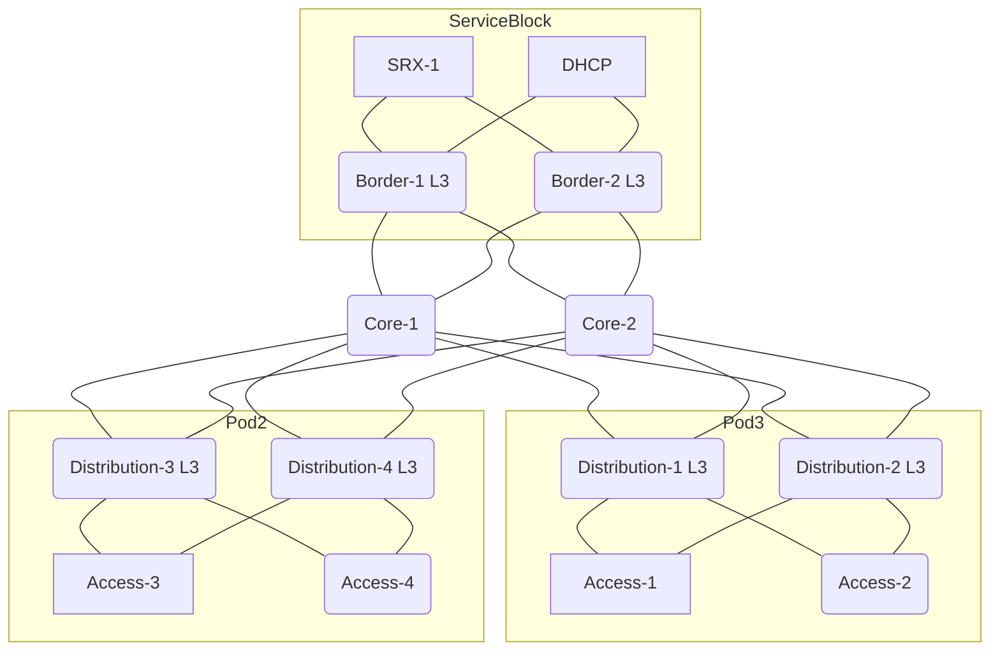
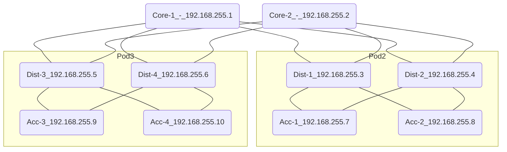

# EVPN (3-Tier Network) with EVPN to Access Layer

This will define a 3-Tier network (Core/Distribution/Access) with EVPN from Core to Access layer
</br>

## Note: This is an early draft of the API for EVPN-VXLAN. Things could change prior to going GA.

</br></br>

### Required Variables:

-   `site_id` xxxxxxxx-xxxx-xxxx-xxxx-00000000000b
-   `device_id` (Core-1)
-   `device_id` (Core-2)
-   `device_id` (Distribution-1)
-   `device_id` (Distribution-2)
-   `device_id` (Access-1)
-   `device_id` (Access-2)
-   `mac_address` (Core-1)
-   `mac_address` (Core-2)
-   `mac_address` (Distribution-1)
-   `mac_address` (Distribution-2)
-   `mac_address` (Access-1)
-   `mac_address` (Access-2)

## EVPN Topology:

In this topology we are doing EVPN between the Core, Distribution and Access layer switches.  For this topology, i used routed_at `distribution` since we are using a pair of border switches and wanted the routing to be symmetric.


See this document for details:
https://www.juniper.net/documentation/en_US/release-independent/nce/topics/concept/nce-evpn-vxlan-campus-arch.html


# Border Role
This document will introduce the concept of a border role in the evpn topology.  The border role in the EVPN topology sits above the Core and is another device that inherits L3 interfaces for the intent of transiting out of the overlay, eg heading toward the WAN/internet.

This document also includes the concept of Pods.  Pods are used to limit the uplink/downlink between switches in the pod.

# Warning:
The API documentation has not been updated for the role of `border`.


# Topology

<div style="page-break-after: always">

## Step 1: (Define Networks/VRFs/PortUsage)

### VRF

This payload configures 2 networks (`vlan101`, `vlan102`) that go into
the `internal_vrf`. The internal VRF also include a static route.

### EVPN Options

We also specify the EVPN option, but these are not required.

### Port Usages

In this scenario, we will define a port usage that will be applied at the access layer so VLANs are plumbed appropriately.

### Site Settings vs Network Template

This can also be applied to a network template and applied to the site, this example is using site settings only.

<div style="page-break-after: always"></div>

### Site Settings
```
    PUT:
    /api/v1/sites/:site_id/setting
```
```JSON
{
    "evpn_options": {
    "overlay": {
        "as": 65000
    },
        "underlay": {
            "as_base": 65001,
            "subnet": "10.255.240.0/20" } },
    "networks": {
        "vlan101": {
            "vlan_id": "101",
            "subnet":"192.168.101.0/24",
            "gateway": "192.168.101.1"},
        "vlan102": {
            "vlan_id": "102",
            "subnet": "192.168.102.0/24",
            "gateway": "192.168.102.1"} },
    "vrf_instances": {
        "internal_vrf": {
            "networks": ["vlan101", "vlan102"],
            "extra_routes": {"0.0.0.0/0": {"via": "192.168.101.254"} } } },
    "port_usages": {
      "distribution-access": {
            "mode": "trunk",
            "disabled": false,
            "port_network": null,
            "voip_network": null,
            "stp_edge": false,
            "all_networks": false,
            "networks": ["vlan101", "vlan102"],
            "port_auth": null,
            "speed": "auto",
            "duplex": "auto",
            "mac_limit": 0,
            "poe_disabled": true,
            "enable_qos": false,
            "storm_control": {},
            "mtu": 9200
        } }  }
```
<div style="page-break-after: always"></div>

## Step 2: Apply Router ID/IRBs/VRF to Access switches

### Router IDs



In this section, we are going to configure 3 things.
* Router ID
* IRB configurations for the L3 Gateways.
* Enable VRF for devices that need VRF

### Access-1 Config
```
PUT:
/api/v1/sites/:site_id/devices/{{ Access-1_device_id }}
```

```JSON
{
"router_id": "192.168.255.7",
```
<div style="page-break-after: always"></div>


### Access-2 Config

```
PUT:
/api/v1/sites/:site_id/devices/{{ Access-2_device_id }}
```


```JSON
{
"router_id": "192.168.255.8"
}
```
<div style="page-break-after: always"></div>

### Access-3 Config

```
PUT:
/api/v1/sites/:site_id/devices/{{ Access-3_device_id }}
```


```JSON
{
"router_id": "192.168.255.9"
}
```
<div style="page-break-after: always"></div>
### Access-4 Config

```
PUT:
/api/v1/sites/:site_id/devices/{{ Access-4_device_id }}
```


```JSON
{
"router_id": "192.168.255.10",
   "other_ip_configs": {
        "vlan101": {
            "type": "static",
            "ip": "192.168.101.5",
            "netmask": "255.255.255.0"
        },
        "vlan102": {
            "type": "static",
            "ip": "192.168.102.5",
            "netmask": "255.255.255.0"
        }
    },
"vrf_config": {
    "enabled": true
	}
}
```
<div style="page-break-after: always"></div>

## Step 3: Apply Router ID config to Distribution and Core switches.

In IP-Clos, the only config applied to the core and distribution switches is the `router_id`


### Scenario 1: Core-1 Config
```
    PUT:
    /api/v1/sites/:site_id/devices/{{ Core-1_device_id }}
```

```JSON
{
    "router_id": "192.168.255.1"
}
```
### Scenario 1: Core-2 Config
```
    PUT: 
    /api/v1/sites/:site_id/devices/{{ Core-2_device_id }}
```

```JSON
{
    "router_id": "192.168.255.2"
}
```

### Scenario 1: Distribution-1 Config
```
    PUT:
    /api/v1/sites/:site_id/devices/{{ Distribution-1_device_id }}
```

```JSON
{
    "router_id": "192.168.255.3",
    "other_ip_configs": {
        "vlan101": {
            "type": "static",
            "ip": "192.168.101.2",
            "netmask": "255.255.255.0"
        },
        "vlan102": {
            "type": "static",
            "ip": "192.168.102.2",
            "netmask": "255.255.255.0"
        }
    },
"vrf_config": {
    "enabled": true
	}
}
```
### Scenario 1: Distribution-2 Config
```
    PUT: 
    /api/v1/sites/:site_id/devices/{{ Distribution-2_device_id }}
```

```JSON
{
    "router_id": "192.168.255.4",
    "other_ip_configs": {
        "vlan101": {
            "type": "static",
            "ip": "192.168.101.3",
            "netmask": "255.255.255.0"
        },
        "vlan102": {
            "type": "static",
            "ip": "192.168.102.3",
            "netmask": "255.255.255.0"
        }
    },
"vrf_config": {
    "enabled": true
	}
}
```

### Scenario 1: Distribution-3 Config
```
    PUT:
    /api/v1/sites/:site_id/devices/{{ Distribution-1_device_id }}
```

```JSON
{
    "router_id": "192.168.255.5",
    "other_ip_configs": {
        "vlan101": {
            "type": "static",
            "ip": "192.168.101.4",
            "netmask": "255.255.255.0"
        },
        "vlan102": {
            "type": "static",
            "ip": "192.168.102.4",
            "netmask": "255.255.255.0"
        }
    },
"vrf_config": {
    "enabled": true
	}
}
```
### Scenario 1: Distribution-4 Config
```
    PUT: 
    /api/v1/sites/:site_id/devices/{{ Distribution-2_device_id }}
```

```JSON
{
    "router_id": "192.168.255.6",
    "other_ip_configs": {
        "vlan101": {
            "type": "static",
            "ip": "192.168.101.5",
            "netmask": "255.255.255.0"
        },
        "vlan102": {
            "type": "static",
            "ip": "192.168.102.5",
            "netmask": "255.255.255.0"
        }
    },
"vrf_config": {
    "enabled": true
	}
}
```

### Scenario 1: Border-1 Config
```
    PUT: 
    /api/v1/sites/:site_id/devices/{{ Distribution-2_device_id }}
```

```JSON
{
    "router_id": "192.168.255.11",
    "other_ip_configs": {
        "vlan101": {
            "type": "static",
            "ip": "192.168.101.6",
            "netmask": "255.255.255.0"
        },
        "vlan102": {
            "type": "static",
            "ip": "192.168.102.6",
            "netmask": "255.255.255.0"
        }
    },
"vrf_config": {
    "enabled": true
	}
}
```

### Scenario 1: Border-2 Config
```
    PUT: 
    /api/v1/sites/:site_id/devices/{{ Distribution-2_device_id }}
```

```JSON
{
    "router_id": "192.168.255.12",
    "other_ip_configs": {
        "vlan101": {
            "type": "static",
            "ip": "192.168.101.7",
            "netmask": "255.255.255.0"
        },
        "vlan102": {
            "type": "static",
            "ip": "192.168.102.7",
            "netmask": "255.255.255.0"
        }
    },
"vrf_config": {
    "enabled": true
	}
}
```

<div style="page-break-after: always"></div>

<div style="page-break-after: always"></div>

## Step 4: Build EVPN Topology:

This step defines which switches will participate in the EVPN and what their role is.  This can be done at the site level, or at the org level, the calls should effectively be the same, except that org-level topologies can have switches from multiple sites.

```
    POST
    /api/v1/sites/:site_id/evpn_topologies
    or 
    /api/v1/sites/:org_id/evpn_topologies
```

```JSON
{
    "name": "Border-Topology",
    "overwrite": true,
    "switches": [{
            "mac": "{{ Core-1_mac_address }}",
            "role": "core"
        },
        {
            "mac": "{{ Core-2_mac_address }}",
            "role": "core"
        },
        {
            "mac": "{{ Distribution-1_mac_address }}",
            "role": "distribution",
            "pod": 2
        },
        {
            "mac": "{{ Distribution-2_mac_address }}",
            "role": "distribution",
            "pod": 2
        },
        {
            "mac": "{{ Access-1_mac_address }}",
            "role": "access",
            "pod": 2
        },
        {
            "mac": "{{ Access-2_mac_address }}",
            "role": "access",
            "pod": 2
        },
        {
            "mac": "{{ Distribution-3_mac_address }}",
            "role": "distribution",
            "pod": 3
        },
        {
            "mac": "{{ Distribution-4_mac_address }}",
            "role": "distribution",
            "pod": 3
        },
        {
            "mac": "{{ Access-3_mac_address }}",
            "role": "access",
            "pod": 3
        },
        {
            "mac": "{{ Access-4_mac_address }}",
            "role": "access",
            "pod": 3
        },
        {
            "mac": "{{ Border-1_mac_address }}",
            "role": "border"
        },
        {
            "mac": "{{ Border-2_mac_address }}",
            "role": "border"
        }
    ]
}
```
<div style="page-break-after: always"></div>

### Record Output from EVPN topology

Sample OUTPUT:

```JSON
{
    "switches": [
        {
            "mac": "{{ Core-1_mac_address }}",
            "evpn_id": 1,
            "model": "xxxxxx-24P",
            "router_id": "192.168.255.1",
            "role": "core",
            "pod": null,
            "uplinks": [
                "{{ Border-1_mac_address }}",
                "{{ Border-2_mac_address }}"
            ],
            "downlinks": [
                "{{ Distribution-1_mac_address }}",
                "{{ Distribution-2_mac_address }}",
                "{{ Distribution-3_mac_address }}",
                "{{ Distribution-4_mac_address }}"
                ],
            "downlink_ips": ["10.255.240.2", "10.255.240.4", "10.255.240.6", "10.255.240.8"]},
        {
            "mac": "{{ Core-2_mac_address }}",
            "evpn_id": 2,
            "model": "xxxxxxx-24P",
            "router_id": "192.168.255.2",
            "role": "core",
            "pod": null,
            "uplinks": [
                "{{ Border-1_mac_address }}",
                "{{ Border-2_mac_address }}"
            ],
            "downlinks": [
                "{{ Distribution-1_mac_address }}",
                "{{ Distribution-2_mac_address }}",
                "{{ Distribution-3_mac_address }}",
                "{{ Distribution-4_mac_address }}"
                ],
            "downlink_ips": ["10.255.240.10", "10.255.240.12", "10.255.240.14", "10.255.240.16"]
        },
        {
            "mac": "{{ Distribution-1_mac_address }}",
            "evpn_id": 3,
            "model": "xxxxxx-48P",
            "router_id": "192.168.255.3",
            "role": "distribution",
            "pod": 2,
            "uplinks": [
                "{{ Core-1_mac_address }}",
                "{{ Core-2_mac_address }}"],
            "downlinks": [
                "{{ Access-1_mac_address }}",
                "{{ Access-2_mac_address }}"],
            "downlink_ips": ["10.255.240.10", "10.255.240.12"]},
        },
        {
            "mac": "{{ Distribution-2_mac_address }}",
            "evpn_id": 4,
            "model": "xxxxxx-48P",
            "router_id": "192.168.255.4",
            "role": "distribution",
            "pod": 2,
            "uplinks": [
                "{{ Core-1_mac_address }}",
                "{{ Core-2_mac_address }}"],
            "downlinks": [
                "{{ Access-1_mac_address }}",
                "{{ Access-2_mac_address }}"],
            "downlink_ips": ["10.255.240.14", "10.255.240.16"]},
        },
        {
            "mac": "{{ Access-1_mac_address }}",
            "evpn_id": 5,
            "model": "xxxxxx-48P",
            "router_id": "192.168.255.5",
            "role": "access",
            "pod": 2,
            "uplinks": [
                "{{ Distribution-1_mac_address }}",
                "{{ Distribution-2_mac_address }}"],
        },
        {
            "mac": "{{ Access-2_mac_address }}",
            "evpn_id": 6,
            "model": "xxxxxx-48P",
            "router_id": "192.168.255.6",
            "role": "access",
            "pod": 2,
            "uplinks": [
                "{{ Distribution-1_mac_address }}",
                "{{ Distribution-2_mac_address }}"]
        },
        {
            "mac": "{{ Distribution-3_mac_address }}",
            "evpn_id": 7,
            "model": "xxxxxx-48P",
            "router_id": "192.168.255.7",
            "role": "distribution",
            "pod": 3,
            "uplinks": [
                "{{ Core-1_mac_address }}",
                "{{ Core-2_mac_address }}"],
            "downlinks": [
                "{{ Access-3_mac_address }}",
                "{{ Access-4_mac_address }}"],
            "downlink_ips": ["10.255.240.10", "10.255.240.12"]
        },
        {
            "mac": "{{ Distribution-4_mac_address }}",
            "evpn_id": 8,
            "model": "xxxxxx-48P",
            "router_id": "192.168.255.8",
            "role": "distribution",
            "pod": 3,
            "uplinks": [
                "{{ Core-1_mac_address }}",
                "{{ Core-2_mac_address }}"],
            "downlinks": [
                "{{ Access-3_mac_address }}",
                "{{ Access-4_mac_address }}"],
            "downlink_ips": ["10.255.240.14", "10.255.240.16"]
        },
        {
            "mac": "{{ Access-3_mac_address }}",
            "evpn_id": 9,
            "model": "xxxxxx-48P",
            "router_id": "192.168.255.9",
            "role": "access",
            "pod": 3,
            "uplinks": [
                "{{ Distribution-3_mac_address }}",
                "{{ Distribution-4_mac_address }}"],
        },
        {
            "mac": "{{ Access-4_mac_address }}",
            "evpn_id": 10,
            "model": "xxxxxx-48P",
            "router_id": "192.168.255.10",
            "role": "access",
            "pod": 3,
            "uplinks": [
                "{{ Distribution-3_mac_address }}",
                "{{ Distribution-4_mac_address }}"
                ]
        },
        {
            "mac": "{{ Border-1_mac_address }}",
            "evpn_id": 11,
            "model": "xxxxxx-48P",
            "router_id": "192.168.255.11",
            "role": "access",
            "uplinks": [
                "{{ Core-1_mac_address }}",
                "{{ Core-2_mac_address }}"
                ]
        },
        {
            "mac": "{{ Border-2_mac_address }}",
            "evpn_id": 12,
            "model": "xxxxxx-48P",
            "router_id": "192.168.255.12",
            "role": "access",
            "uplinks": [
                "{{ Core-1_mac_address }}",
                "{{ Core-2_mac_address }}"
                ]
        }
    ]
}
```

<div style="page-break-after: always"></div>

## Step 5: Match up the EVPN topology uplinks and downlinks.
In the EVPN topology output each switch will have uplinks,downlinks or both. Each Core switch will
have evpn_downlinks. Each Distribution switch will have both evpn_uplinks and evpn_downlinks.  Access switches will have uplinks only.  If border roles are present, they will have downlinks only, and this will add uplinks to the core switches.

The EVPN Topology will tell you which links go where.

In cases where there are multiple of the same type (uplinks/downlinks), the order is important.  If the EVPN topology says that Core 1 has 2 downlinks (Distribution-1 and Distribution-2), it's important that you list those in the appropriate order and in a single entry.

### Make sure you match up the port to the correct port type (ge vs mge vs xe vs et)

### Core-1 Port Config

```
    PUT:
    /api/v1/sites/:site_id/devices/{{ Core-1_device_id }}
```

```JSON
{
    "port_config": {
        "ge-0/0/22-23": {
            "usage": "evpn_downlink"
        },
        "ge-0/0/20-21": {
            "usage": "evpn_uplink"
        },
    }
}
```

Based on the configuration and output from the EVPN_Topology, Core-1
will have:
* `ge-0/0/22` connected to `Distribution-1`  
* `ge-0/0/23` connected to `Distribution-2`
* `ge-0/0/20` connected to `Border-1`
* `ge-0/0/21` connected to `Border-2`

<div style="page-break-after: always"></div>


### Core-2 Port Config

```
    PUT:
    /api/v1/sites/:site_id/devices/{{ Core-2_device_id }}
```

```JSON
{
    "port_config": {
        "ge-0/0/22-23": {
            "usage": "evpn_downlink"
        },
        "ge-0/0/20-21": {
            "usage": "evpn_uplink"
        },
    }
}
```

Based on the configuration and output from the EVPN_Topology, Core-2
will have:
* `ge-0/0/22` connected to `Distribution-1`  
* `ge-0/0/23` connected to `Distribution-2`
* `ge-0/0/20` connected to `Border-1`
* `ge-0/0/21` connected to `Border-2`  

<div style="page-break-after: always"></div>

### Distribution-1 Port Config

```
    PUT:
    /api/v1/sites/:site_id/devices/{{ Distribution-1_device_id }}
```

```JSON
{
    "port_config": {
        "ge-0/0/22-23": {
            "usage": "evpn_uplink"
            },
        "ge-0/0/1-2": {
            "usage": "evpn_downlink"
            }
        }
    }
}
```

Based on the configuration and output from the EVPN_Topology,
Distribution-1 will have:
* `ge-0/0/22` connected to `Core-1`  
* `ge-0/0/23` connected to `Core-2`  
* `ge-0/0/1` to connect to `Access-1`  
* `ge-0/0/2` to connect to `Access-2`

<div style="page-break-after: always"></div>

### Distribution-2 Port Config

```
    PUT:
    /api/v1/sites/:site_id/devices/{{ Distribution-2_device_id }}
```

```JSON
{
    "port_config": {
        "ge-0/0/22-23": {
            "usage": "evpn_uplink"
            },
        "ge-0/0/1-2": {
            "usage": "evpn_downlink"
            }
        }
    }
}
```

Based on the configuration and output from the EVPN_Topology,
Distribution-2 will have:
* `ge-0/0/22` connected to `Core-1`  
* `ge-0/0/23` connected to `Core-2`  
* `ge-0/0/1` to connect to `Access-1` 
* `ge-0/0/2` to connect to`Access-2` 

<div style="page-break-after: always"></div>

### Access-1 Port Config

```
    PUT:
    /api/v1/sites/:site_id/devices/{{ Access-1_device_id }}
```

```JSON
{
    "port_config": {
        "ge-0/0/22-23": {
            "usage": "evpn_uplink"
            },
        "ge-0/0/0": {
            "usage": "distribution-access"
            }
        }
    }
}
```

Based on the configuration and output from the EVPN_Topology,
Access-1 will have:
* `ge-0/0/22` connected to `Distribution-1`  
* `ge-0/0/23` connected to `Distribution-2`  

<div style="page-break-after: always"></div>

### Access-2 Port Config

```
    PUT:
    /api/v1/sites/:site_id/devices/{{ Access-2_device_id }}
```

```JSON
{
    "port_config": {
        "ge-0/0/22-23": {
            "usage": "evpn_uplink"
            },
        "ge-0/0/0": {
            "usage": "distribution-access"
            }
        }
    }
}
```

Based on the configuration and output from the EVPN_Topology,
Access-2 will have:
* `ge-0/0/22` connected to `Distribution-1`  
* `ge-0/0/23` connected to `Distribution-2`  

<div style="page-break-after: always"></div>


### Border-1 Port Config

```
    PUT:
    /api/v1/sites/:site_id/devices/{{ Border-1_device_id }}
```

```JSON
{
    "port_config": {
        "ge-0/0/20-21": {
            "usage": "evpn_downlink"
            }
        }
    }
}
```

Based on the configuration and output from the EVPN_Topology,
Access-2 will have:
* `ge-0/0/20` connected to `Core-1`  
* `ge-0/0/21` connected to `Core-2`  

<div style="page-break-after: always"></div>

### Border-2 Port Config

```
    PUT:
    /api/v1/sites/:site_id/devices/{{ Border-2_device_id }}
```

```JSON
{
    "port_config": {
        "ge-0/0/20-21": {
            "usage": "evpn_downlink"
            }
        }
    }
}
```

Based on the configuration and output from the EVPN_Topology,
Access-2 will have:
* `ge-0/0/20` connected to `Core-1`  
* `ge-0/0/21` connected to `Core-2`  

<div style="page-break-after: always"></div>