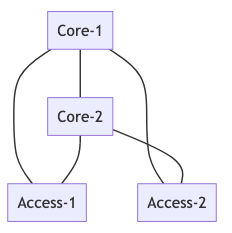

# EVPN Multihoming (collapsed-core with ESI-LAG)
This will define a single pair of collapsed core switches and EVPN Multihoming (ESI-LAG) to the access layer.
</br>

## Note: This is an early draft of the API  for EVPN-VXLAN.  Things could change prior to going GA.
</br></br>

### Required Variables:
* `device_id` (Core-1)
* `device_id` (Core-2)
* `mac_address` (Core-1)
* `mac_address` (Core-2)

EVPN-Topology:
In this scenario the EVPN lives exclusively at the collapsed core. Trunks down to the access layer rely on ESI-LAG to handle the LAG.

<div style="page-break-after: always"></div>



## Step 1: (Define Networks/VRFs)
This payload configures 2 networks (`vlan101`, `vlan102`) that go into the `internal_vrf`.  The internal VRF also include a static route.  In addition, we define a port_usage of `core_access` to describe the trunk link between the core and the access layer.  This is a simple trunk, as there is no VXLAN running to the access layer.

We also specify the EVPN option, but these are not required.

This can also be applied to a network template, this example is using a site only.

<div style="page-break-after: always"></div>

```
PUT:
/api/v1/sites/:site_id/setting
```

```JSON
{
"networks": {
        "vlan101": {
            "vlan_id": "101",
            "subnet": "192.168.101.0/24",
            "gateway": "192.168.101.1"
        },
        "vlan102": {
            "vlan_id": "102",
            "subnet": "192.168.102.0/24",
            "gateway": "192.168.102.1"
        }
    },
  "vrf_instances": {
      "internal_vrf": {
          "networks": [
              "vlan101",
              "vlan102"
          ],
          "extra_routes": {
              "0.0.0.0/0": {
                  "via": "192.168.192.1"
              }
          }
      }
    }
    "port_usages": {
      "core_access": {
            "mode": "trunk",
            "disabled": false,
            "port_network": null,
            "voip_network": null,
            "stp_edge": false,
            "all_networks": false,
            "networks": [
                "vlan101",
                "vlan102"
            ],
            "port_auth": null,
            "speed": "auto",
            "duplex": "auto",
            "mac_limit": 0,
            "poe_disabled": true,
            "enable_qos": false,
            "storm_control": {},
            "mtu": 9200
        }
    },
    "evpn_options": {
        "overlay": {
            "as": 65000
        },
            "underlay": {
                "as_base": 65001,
                "subnet": "10.255.240.0/20"
            }
    }
}
```
<div style="page-break-after: always"></div>

## Step 2: Apply EVPN config to each collapse-core switches
In this section we are applying the router_id to each switch as well as enabling vrf for the two collapsed-core switches.

<div style="page-break-after: always"></div>

```
PUT:
/api/v1/sites/:site_id/devices/{{ Core-1_device_id }}
```

```JSON
{
"router_id": "192.168.255.11",
"other_ip_configs": {
        "vlan101": {
            "type": "static",
            "ip": "192.168.101.2",
            "netmask": "255.255.255.0"
        },
        "vlan102": {
            "type": "static",
            "ip": "192.168.102.2",
            "netmask": "255.255.255.0"
        }
    },
"vrf_config": {
    "enabled": true
	}
}
```

```
PUT:
/api/v1/sites/:site_id/devices/{{ Core-2_device_id }}
```

```JSON
{
"router_id": "192.168.255.12",
   "other_ip_configs": {
        "vlan101": {
            "type": "static",
            "ip": "192.168.101.3",
            "netmask": "255.255.255.0"
        },
        "vlan102": {
            "type": "static",
            "ip": "192.168.102.3",
            "netmask": "255.255.255.0"
        }
    },
"vrf_config": {
    "enabled": true
	}
}
```
<div style="page-break-after: always"></div>

## Step 3: Build EVPN Topology:
```
POST
/api/v1/sites/:site_id/devices/evpn_topology
```

```JSON
{
	"overwrite": true,
	"switches": [{
			"mac": "{{ Core-1_mac }}",
			"role": "collapsed-core"
		},
		{
			"mac": "{{ Core-2_mac }}",
			"role": "collapse-core"
		}
	]
}
```
## Step 4: Record the EVPN Topology Output:

```JSON
{
    "switches": [
        {
            "mac": "{{ Core-1_mac_address }}",
            "evpn_id": 1,
            "model": "xxxxxx-48Y",
            "router_id": "192.168.255.11",
            "role": "collapsed-core",
            "uplinks": [
                "{{ Core-2_mac_address }}"
            ],
            "downlinks": [
                "{{ Core-2_mac_address }}"
            ],
            "downlink_ips": [
                "10.255.240.2"
            ]
        },
        {
            "mac": "{{ Core-2_mac_address }}",
            "evpn_id": 2,
            "model": "xxxxxx-48Y",
            "router_id": "192.168.255.12",
            "role": "collapsed-core",
            "uplinks": [
                "{{ Core-1_mac_address }}"
            ],
            "downlinks": [
                "{{ Core-1_mac_address }}"
            ],
            "downlink_ips": [
                "10.255.240.4"
            ]
        }
    ]
}
```
You will need to identify which switches have uplinks/downlinks.  In this scenario, both switches should have 1 uplink and 1 downlink.

## Step 4: Match up the EVPN topology uplinks and downlinks.
Each switch will have uplinks, and downlinks.  For Collapsed-core, each switch should have an uplink and downlink for redudancy.

For uplink ports, use the port_usage `evpn_uplink`
For downlink ports, use port_usage `evpn_downlink`.

Also, make sure you match up the port to the correct port type (ge vs mge vs xe vs et)

Here will will also push the config for the ESI-lag down to the access-layer switch, which will use the port_usage `core_access`.

In this scenario, we push the `ae_idx` in order to keep the configuration consistent between the two core switches.


<div style="page-break-after: always"></div>

```
PUT:
/api/v1/sites/:site_id/devices/{{ Core1-device_id }}
```

```JSON
{
    "port_config": {
        "ge-0/0/23": {
          "usage": "evpn_uplink"
          },
        "ge-0/0/22": {
          "usage": "downlink"
        },
        "ge-0/0/0": {
          "usage": "core_access",
          "aggregated": true,
          "ae_idx": 1,
          "esilag": true
        }
    }
}
```
```
PUT:
/api/v1/sites/:site_id/devices/{{ Core2-device_id }}
```
```JSON
{
    "port_config": {
        "ge-0/0/23": {
          "usage": "evpn_downlink"
          },
        "ge-0/0/22": {
          "usage": "evpn_uplink"
          },
        "ge-0/0/y": {
          "usage": "core_access",
          "aggregated": true,
          "ae_idx": 1,
          "esilag": true
        }
    }
}
```
<div style="page-break-after: always"></div>

### Multiple uplinks/downlinks:

If you have multiple uplinks/downlinks you are configuring, they must be put in a range statement for the port_config.  And the order corresponds to the order they are in the EVPN topology.

### Example
```JSON
{
    "port_config": {
        "ge-0/0/10-11": {"usage": "evpn_uplink"},
        "ge-0/0/20-21": {"usage": "evpn_downlink"},
    }
}
```


## Step 5:
Configure uplink on access-layer switch as a normal aggregation in the mist UI.

## Warning regarding UI messages
Until the UI is updated to support EVPN, you may receive errors about profiles missing.  Specifically `evpn_uplink` and `evpn_downlink`.  DO NOT CREATE THESE PROFILES.  The logic is handled in the backend for these two profiles, creating them will cause issues.

