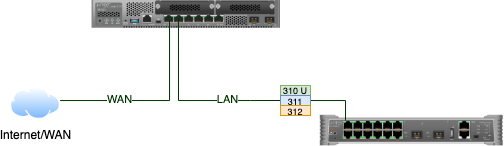

# Gateway Configuration Through Mist

This document outlines the basics of how to configure a branch SRX with a basic config through Mist.  

## Disclaimer:
This is currenty not GA, and therefore anything can change prior to GA release.  Also, this has only been tested in staging and not in production environments.  Do not use for production environments without talking with Mist product management team.


## Topology:
In this example we will have a basic setup where port `ge-0/0/0` will connect to a DHCP enabled WAN and port `ge-0/0/1` will connect to the LAN which is our EX2300C-12P.


<div style="page-break-after: always">

## Build Gateway Template Payload
For this example everything will go into the Gateway template.  If we had networks that crossed sites, we could define these at the org/networks level.  We could also define items at the site or device level, but for the simplicity of this guide, we are going create it all at the gatewaytemplate level.

### LAN Config

For our LAN we will setup 3 networks that we need. `corporate, wireless, guest`.  You can expand these out to meet the needs of your site.

```json
{
    "name": "JakeLab_Gateway",
    "networks": {
        "corporate": {
            "vlan_id": 310,
            "subnet": "10.253.10.0/24",
            "gateway": "10.253.10.1",
            "isolation": false,
            "internet_access": {
                "enabled": true,
                "restricted": false
            }
        },
        "wireless": {
            "vlan_id": 311,
            "subnet": "10.253.11.0/24",
            "gateway": "10.253.11.1",
            "isolation": false,
            "internet_access": {
                "enabled": true,
                "restricted": false
            }
        },
        "guest": {
            "vlan_id": 312,
            "subnet": "10.253.12.0/24",
            "gateway": "10.253.12.1",
            "isolation": false,
            "internet_access": {
                "enabled": true,
                "restricted": true
            }
        }

    }
     
}
```

### LAN IP Configurations:
For each of our LAN networks, we need to define the IP address information in the gateway template.

```json
{
    "ip_configs": {
        "corporate": {
            "ip": "10.253.10.1",
            "netmask": "/24"
        },
        "wireless": {
            "ip": "10.253.11.1",
            "netmask": "/24"
        },
        "guest": {
            "ip": "10.253.12.1",
            "netmask": "/24"
        }
    }
}

```

### DHCP Services
For our configuration example, we want the SRX to act as the DHCP server, so we will define the DHCP pools for each.

```json
{
    "dhcpd_config": {
        "enabled": true,
        "corporate": {
            "type": "local",
            "ip_start": "10.253.10.10",
            "ip_end": "10.253.10.200",                
            "gateway": "10.253.10.1",
            "dns_servers": [ "8.8.8.8", "4.4.4.4" ],
            "dns_suffix": [ ".remote.mylab.com", ".mylab.com" ]
        },
        "wireless": {
            "type": "local",
            "ip_start": "10.253.11.10",
            "ip_end": "10.253.11.200",                
            "gateway": "10.253.11.1",
            "dns_servers": [ "8.8.8.8", "4.4.4.4" ],
            "dns_suffix": [ ".remote.mylab.com", ".mylab.com" ]
        },
        "guest": {
            "type": "local",
            "ip_start": "10.253.12.10",
            "ip_end": "10.253.12.200",                
            "gateway": "10.253.12.1",
            "dns_servers": [ "8.8.8.8", "4.4.4.4" ],
            "dns_suffix": [ ".remote.mylab.com", ".mylab.com" ]
        }
    }
}
```

### Port Configurations
Here is where we will define the configuration for the physical ports.  We will use usage `wan` for the wan port.  We also need to specify its IP configuration as well as the `wan_type`.  For additional configuration options, please see the API documentation.

For the LAN, we are configurating these as tagged ports, so the configuration will look similar to the API for a switchport config.

```json
{
    "port_config": {
        "ge-0/0/0": {
            "usage": "wan",
            "name": "wan0",

            "wan_type": "broadband",
            "ip_config": {
                "type": "dhcp"
            }
        },
        "ge-0/0/1-3": {
            "usage": "lan",
            "networks": ["corporate", "wireless", "guest"],
            "port_network": "corporate"
        },
        "ge-0/0/4-5": {
            "usage": "lan",
            "networks": ["corporate", "wireless", "guest"],
            "port_network": "corporate",
            "aggregated": true
        }
    }
}
```

## Create Gateway Template
Now we combine this into a single payload and push to the cloud.  You can see the gateway-template-lab.json file for the full payload used.

```
POST /api/v1/orgs/:org_id/gatewaytemplates
```

the response that comes back should include the `id` of this new gateway template.

```json
{
    ...
    "id": "xxxxxxxxxx-xxxx-xxxx-xxxx-xxxxxxxxxx123",
    ...
}
```

To apply this to the site in question, update the site to use this `gatewaytemplate_id`.

```
PUT /api/v1/sites/:site_id
```

with the payload:
```json
{
    "gatewaytemplate_id": "xxxxxxxxxx-xxxx-xxxx-xxxx-xxxxxxxxxx123"
}

```

## Adopt SRX and assign to site
At this point if you have not adopted your SRX and claimed it to the site, you should do so.


## Verify config to be pushed to SRX

Before we enable management of gateway, we should verify the commands being pushed.

```
GET /api/v1/sites/:site_id/devices/:deivce_id/config_cmd
```

## Enable management of SRX
Finally, we just need to enable management of the SRX.

```
PUT /api/v1/sites/:site_id/devices/:device_id
```

with a payload of:
```json
{
    "adopted": true,
    "managed": true
}
```

